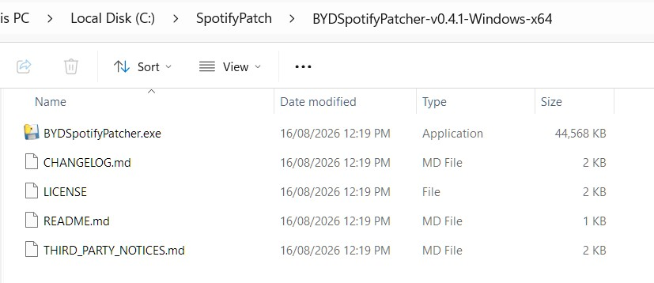
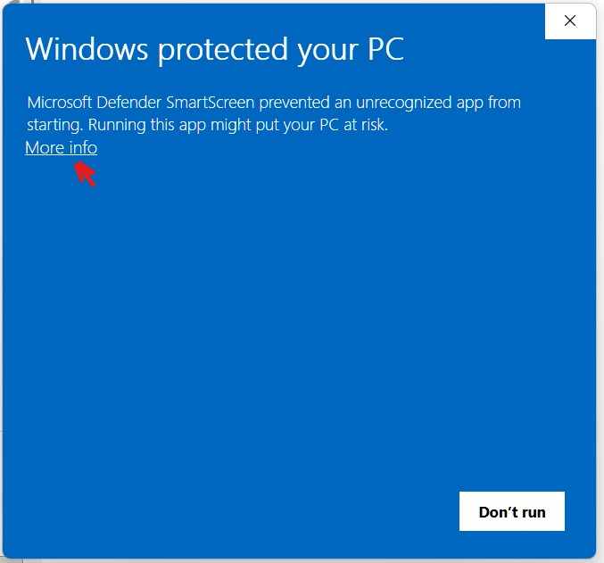
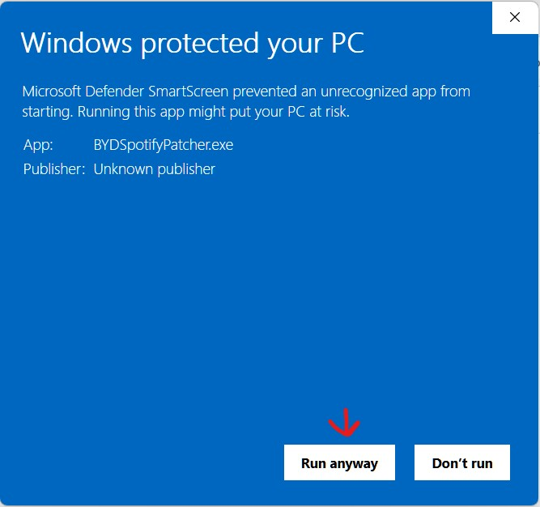
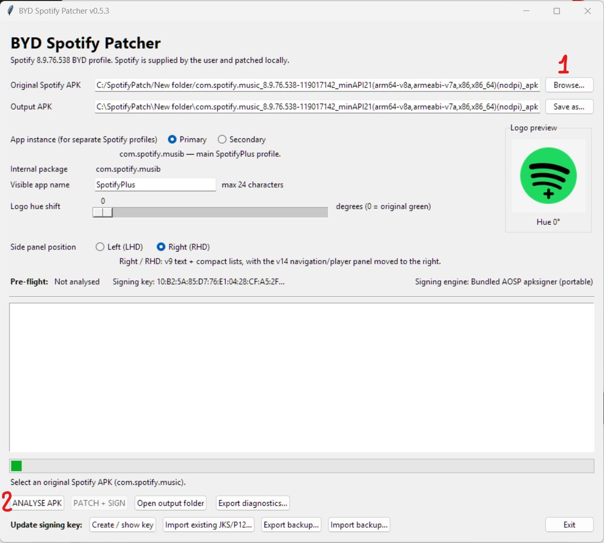
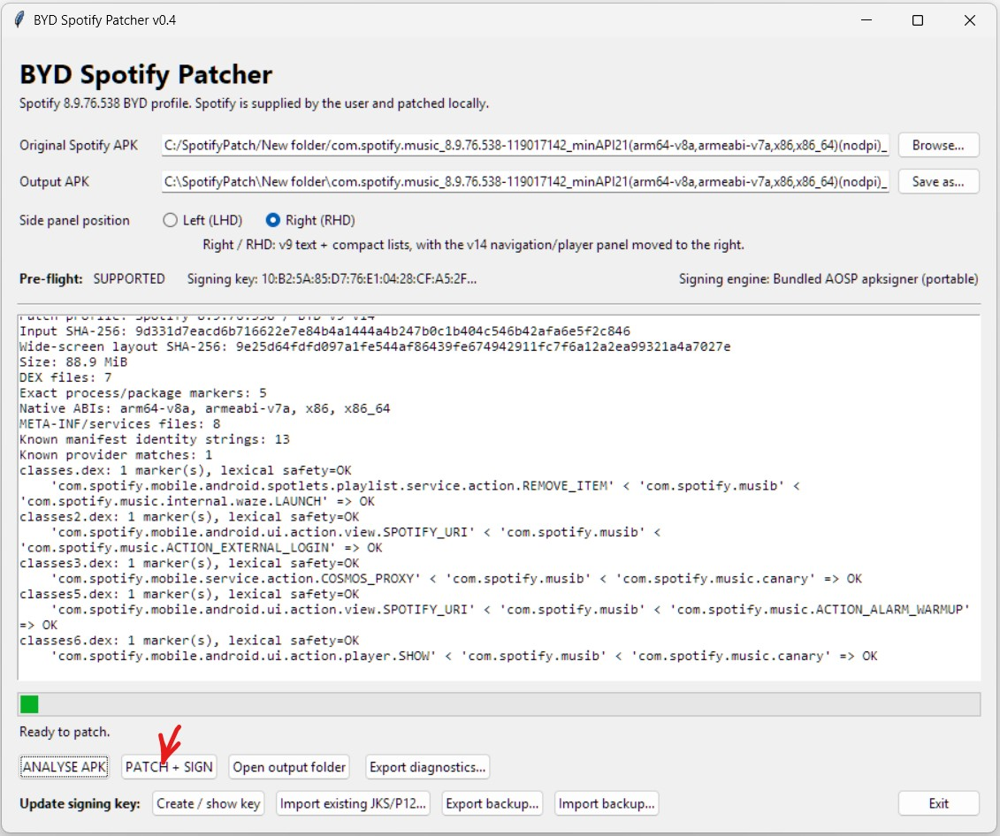
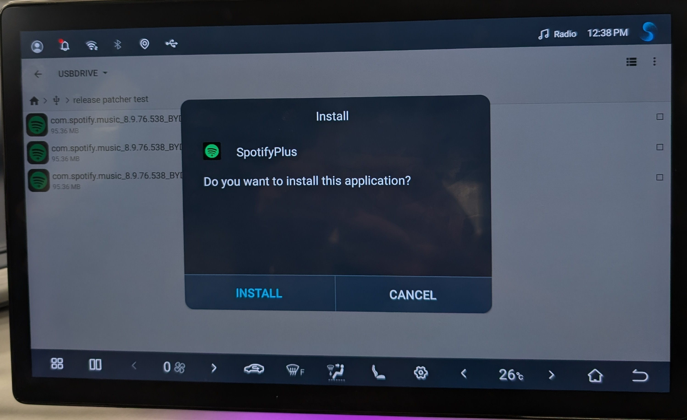
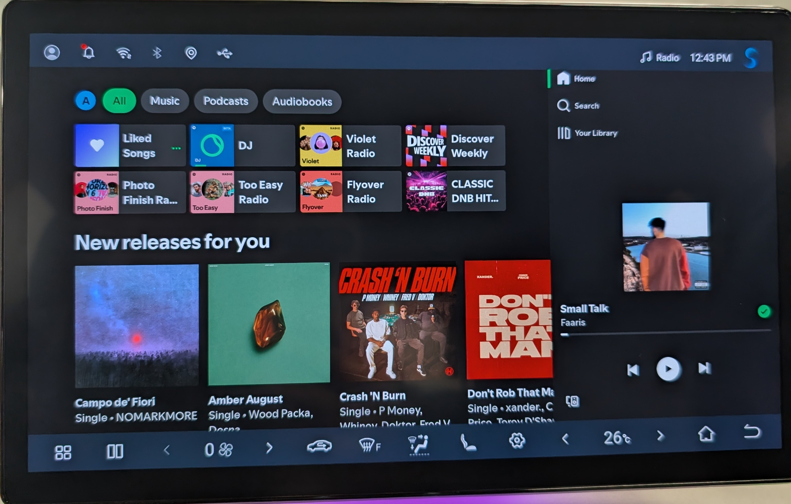

# BYD Spotify Patcher v0.6

Windows tool for patching a **user-supplied Spotify 8.9.76.538 APK** for BYD Android infotainment.

The patcher does **not** contain or download Spotify. The original APK is supplied by the user and patched locally on their PC.

## Features
- Allows to use fully functional Spotify app within BYD infotainment system. (DJ X, sorting playlists by genre, easy to start radio from a song, albums, lyrics, artists information, etc.)
- Install **Primary** and **Secondary** Spotify clones alongside BYD's factory Spotify app.
- Keep separate Spotify accounts/profiles in each clone.
- Applies **BYD-optimised wide-screen UI** fixes.
- Three **Font size** choices: **Stock**, **Moderate**, or **Large**.
- **Left (LHD)** or **Right (RHD)** navigation/player panel with visual previews.
- Custom visible app name. SpotifyPlus as default.
- Optional **+ badge** on the launcher icon. Adjustable launcher-icon hue with live preview
- Restores playback after the BYD infotainment system restarts.
- Automatic APK patching, signing and verification.

## Supported Spotify version

Currently supported:

- Spotify **8.9.76.538**
- versionCode **119017142**

Download the tested universal / nodpi APK from **[APKMirror](https://www.apkmirror.com/apk/spotify-ab/spotify/spotify-music-and-podcasts-8-9-76-538-release/spotify-music-and-podcasts-8-9-76-538-2-android-apk-download/)**.

Other Spotify versions are rejected by **ANALYSE APK** rather than being patched with an untested profile.

## How to use

The main window is intentionally simple: choose the patch options, then use **ANALYSE APK** and **PATCH + SIGN**.

1. Download the Windows patcher from **[Releases](../../releases/latest)**.
2. Download the supported Spotify 8.9.76.538 APK.
3. Start `BYDSpotifyPatcher.exe`.

   Windows may show a security warning because the patcher is not code-signed with a commercial certificate. This is expected for an independently distributed open-source tool and does not mean Windows has detected malware. If SmartScreen appears, click **More info** and then **Run anyway**.

4. Select the original Spotify APK.
5. Choose **Primary** or **Secondary**.
6. Optionally change the visible app name, icon badge and icon colour.
7. Choose **Stock**, **Moderate** (recommended), or **Large** font size.
8. Choose **Left (LHD)** or **Right (RHD)** using the visual panel previews.
9. Leave **Prevent portrait mode** enabled for BYD use.
10. Click **ANALYSE APK**.

11. If the APK is supported, click **PATCH + SIGN**.

12. Install the generated APK on the BYD infotainment system.

The patched apps can coexist with each other and with BYD's original `com.spotify.music` installation.

## BYD-optimised UI

v0.6 always applies the established BYD visual/layout profile. It improves the wide-screen spacing, artwork/control sizing and car-friendly layout instead of exposing an unmodified Spotify-layout option.

Choose the panel position at patch time:

- **Left (LHD)** — navigation and mini-player stay on the left.
- **Right (RHD)** — navigation and mini-player move to the right while Spotify content remains LTR.

### Font size

Font sizing is independent of the BYD visual/layout fixes:

- **Stock** — original Spotify text sizes with the BYD-optimised layout.
- **Moderate** — the established BYD text enlargement used by the earlier car-tested profile.
- **Large** — Moderate plus a further roughly 15% increase to the identified Spotify text-size resources.

**Moderate** is the default.

## Portrait-screen fix

Spotify 8.9.76.538 contains several activities that explicitly request portrait orientation. Queue is portrait-locked in the manifest, while fullscreen Lyrics also requests portrait at runtime.

With **Prevent portrait mode** enabled, the patcher removes the known portrait-only requests so those screens follow the BYD display orientation instead.

## Playback restore

Playback restoration has been tested on BYD infotainment. If a patched Spotify instance was playing before the vehicle was shut down, that instance can resume playback after the infotainment system restarts.

## Download

The self-contained Windows release is available from **[GitHub Releases](../../releases/latest)**.

No Python, Java, Android Studio or Android SDK is required to use the released Windows version.

## Notes

This project modifies a user-supplied Spotify APK so cloned instances can coexist with the original BYD installation and work correctly on the BYD wide-screen interface.

**No Spotify APK, Spotify DEX, Spotify resources or other Spotify binaries are distributed with this project.**
